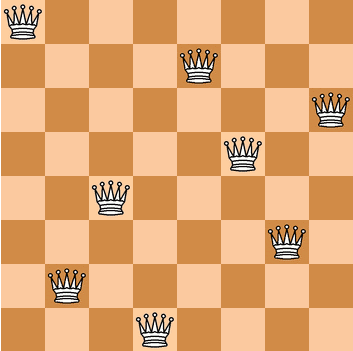

# 八皇后问题

时间退回到1848年，国际西洋棋棋手马克斯·贝瑟尔提出了这样的一个问题，

> 在8×8格的国际象棋上摆放八个皇后，使其不能互相攻击，即任意两个皇后都不能处于同一行、同一列或同一斜线上，问一共有多少种摆法。

后面陆续有不同的学者提出自己的见解。大数学家高斯认为一共有76种摆法，1854年在柏林的象棋杂志上不同的作者发表了共计40种不同的见解，后来还有人利用图论的方法得出共有92种摆法。

八皇后问题是一个经典的数学和计算机科学问题, 问题的目标是找到所有满足条件的解法。

八皇后问题具有重要的数学和计算机科学价值。它不仅仅是一个简单的问题，而是涉及到组合数学、图论、搜索算法等多个领域的交叉应用。解决八皇后问题需要思考和设计高效的算法，并且可以推广到更大的棋盘和更多的皇后数量上。通过研究八皇后问题，可以提升问题解决能力、算法设计能力以及对计算复杂性的理解。此外，八皇后问题也是计算机科学教育中常用的经典案例，用于教授递归、回溯和算法设计等基本概念。

总而言之，八皇后问题是一个经典的、具有挑战性和教育意义的问题，它的解法和研究对于算法、数学和计算机科学领域都具有重要的价值。

解决八皇后问题有多种方法，其中一种常见的方法是使用回溯算法。回溯算法是一种试探性的搜索算法，在搜索过程中通过选择和取消选择来找到解决问题的方案。对于八皇后问题，回溯算法会遍历每一行的每一个列，尝试放置皇后，并检查是否满足约束条件。如果满足条件，则继续放置下一个皇后；如果不满足条件，则回溯到上一个状态，重新选择放置位置。通过递归地应用回溯算法，可以找到所有的解法。

### 在解决八皇后问题时，回溯算法可以通过以下步骤来分解问题：

1. 定义棋盘和皇后的表示：确定使用的棋盘大小，通常是一个n × n的方格棋盘，其中n为皇后的数量。

2. 选择放置位置：从第一行开始，逐行尝试将皇后放置在不同的列上。在每一行，选择一个合适的列来放置皇后，使得该皇后不与之前放置的皇后冲突。 
   - 如果找到一个合适的位置，则进入下一行继续放置皇后；
   - 如果没有找到合适的位置，则回溯到上一行，重新选择放置位置。

3. 检查约束条件：在选择放置位置时，需要检查当前位置是否满足约束条件。约束条件是指任意两个皇后不能处于同一行、同一列或同一对角线上。通过比较当前位置与之前已放置皇后的位置，可以确定是否满足约束条件。

4. 记录解法：当成功放置了所有的皇后，即遍历完所有行，得到一个解法。将该解法记录下来，继续尝试其他的放置方式。

5. 回溯和剪枝：在回溯算法中，如果在某一行没有找到合适的放置位置，需要回溯到上一行重新选择。回溯的过程涉及取消选择前一行的放置位置，然后尝试下一个位置。通过剪枝操作，可以提前排除一些不符合条件的选择，从而减少回溯的次数，提高算法的效率。

6. 获取所有解法：继续重复步骤2至步骤5，直到遍历完所有的可能情况。最终，可以得到所有满足条件的解法。

总之，回溯算法通过递归和回溯的方式，不断尝试和回退来搜索所有可能的解决方案。在解决八皇后问题中，回溯算法的核心是选择合适的放置位置，并通过检查约束条件来判断是否满足要求。通过不断地尝试和回溯，最终可以找到所有满足条件的解法。
