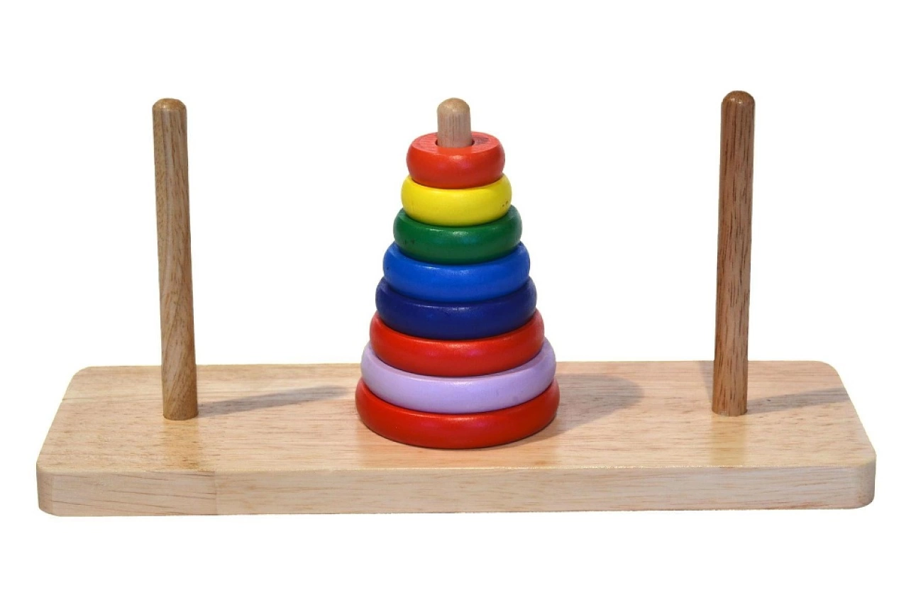
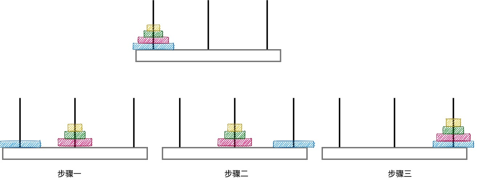

# 汉罗塔

汉诺塔（Hanoi Tower）是经典的数学问题，也被称为汉诺塔益智游戏。它由法国数学家 Edouard Lucas 在19世纪提出，以印度古代传说中的 Bramah 汉诺塔寺庙而得名。

汉诺塔问题的初始状态是有三根柱子（通常标记为A、B、C）的塔，其中塔A上按照从小到大的顺序叠放着若干个圆盘，较小的圆盘在上面，较大的圆盘在下面。目标是将塔A上的所有圆盘按照规定的移动规则，移动到塔C上，最终得到与初始状态相同的塔形状。

## 移动规则如下：
1. 每次只能移动一个圆盘。
2. 移动过程中，任何时候都不能将一个较大的圆盘放在较小的圆盘之上。
3. 只能通过将圆盘从一个柱子移动到另一个柱子来实现。

求解汉诺塔问题的经典算法是使用递归。基本思想是将问题分解为更小的子问题（分治算法），并利用递归的方式依次解决子问题。

## 具体的求解步骤如下：

1. 如果只有一个圆盘，直接将其从塔A移动到塔C，问题解决。
2. 如果有多个圆盘，可以将其分解为三个子问题：
    - 将塔A上的 n-1 个圆盘移动到塔B，以塔C作为辅助塔。
    - 将塔A上剩下的最大圆盘移动到塔C。
    - 将塔B上的 n-1 个圆盘移动到塔C，以塔A作为辅助塔。
3. 递归地应用上述步骤解决子问题。

通过递归的方式，每次将较大的圆盘作为一个整体移动到目标塔，而将较小的圆盘视为一个整体辅助移动。最终，所有的圆盘都按照规定的顺序移动到了目标塔，完成了问题的求解。

汉诺塔问题是一个经典的递归问题，具有良好的数学性质和递推关系。它不仅在数学领域中具有重要意义，也被广泛应用于算法和编程的教学和实践中。
