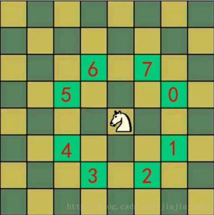

# 马踏棋

**马踏棋游戏（也称为马走日）是一种棋盘游戏，目标是使棋盘上的马按照特定的规则移动，经过棋盘上的每个格子，最终达到指定的目标位置。**

## 以下是马踏棋游戏的规则：
1. **游戏棋盘**：马踏棋游戏通常在一个正方形的棋盘上进行，棋盘上有固定的行数和列数。
2. **初始位置**：游戏开始时，马会被放置在棋盘上的一个起始位置。
3. **移动规则**：马按照特定的移动规则进行移动。马可以沿着棋盘上的某个方向走两步，然后转向，再走一步。具体来说，马可以走日字型的路径，即先向上或向下走两步，然后向左或向右转弯，再走一步。马不能斜着走或直接跳过其他棋盘格。
4. **目标位置**：游戏的目标是使马按照规定的移动方式，经过棋盘上的每个格子，最终到达指定的目标位置。

马踏棋游戏可以有不同的难度级别，根据棋盘的大小和目标位置的设定，游戏的难度会有所变化。这个游戏可以锻炼思维和规划能力，同时也是一种有趣的智力挑战。

这里有个[马踏棋的游戏](http://h5.17173.com/content/05252016/143559215.shtml?__stay_on_pc) ,可以试玩一下！

## 游戏算法

马踏棋算法属于一个经典的图的深度优先算法的应用，通过搜索和回溯的方式来找到满足游戏规则的路径。整个求解过程如下：
1. **定义棋盘**：确定棋盘的大小，通常是一个正方形棋盘，具有固定的行数和列数。
2. **定义起始位置和目标位置**：确定马的初始位置和游戏的目标位置。 
3. **初始化数据结构**：创建一个空的棋盘矩阵(可以是一个二维数组，也可以是用Cell的集合)，并将起始位置标记为已访问。
4. **回溯搜索**：从起始位置开始，使用回溯搜索算法探索所有可能的移动路径。
  - 从当前位置开始，按照马的移动规则尝试所有可能的下一步位置。 
  - 对于每个可行的下一步位置，检查是否已经访问过。如果已访问过，则放弃该路径；否则，标记为已访问，并进入下一步递归调用。
  - 当达到目标位置时(或者棋盘结束)，记录当前路径为有效路径。
5. **输出结果**：输出所有找到的有效路径、选择其中一条最短路径或者是走完所有的棋盘作为解决方案。
