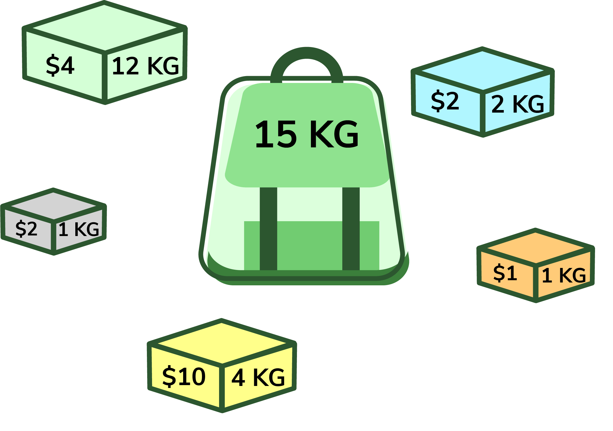
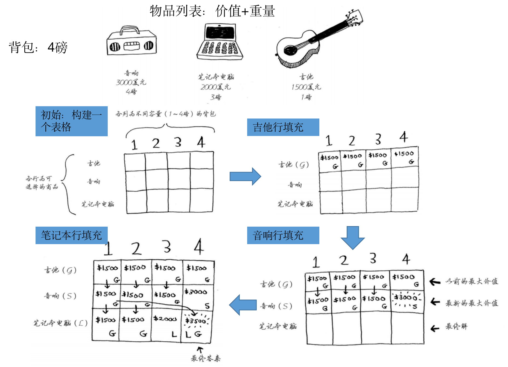

# 背包算法

**背包算法（Knapsack algorithm）是一种经典的组合优化算法，主要用于解决背包问题。背包问题是指在给定的一组物品中，选择一部分物品放入背包中，使得物品的总价值最大化，同时保证背包的容量限制。**

背包算法的应用场景非常广泛，特别是在资源分配、调度和优化等领域。

## 一些常见的应用场景包括：

1. **资源分配问题**：在有限的资源下，选择最优的资源分配方案，例如任务调度、货物装载等。
2. **割点问题**：在无向图中，找到一组节点，移除这组节点后，将图分割成多个连通分量。
3. **0/1背包问题**：物品具有不可分割的特性，每个物品只能选择放入或不放入背包。
4. **分数背包问题**：物品可以划分为更小的部分，可以选择部分物品放入背包，通常使用贪心算法解决。
5. **多维背包问题**：物品具有多个属性或限制条件，例如重量、体积、价值等。

背包算法的应用场景还远不止以上几个，它在组合优化、动态规划、最优化问题等领域都有广泛的应用。通过灵活的问题建模和算法设计，可以将背包算法应用到各种实际问题中，帮助进行决策和优化。

## 求解思路

通常，背包问题有两种求解思路：

### 动态规划算法

动态规划方法使用一个二维数组来保存中间状态，利用状态转移方程逐步求解最优解。递归溯源方法则通过递归函数进行深度搜索，根据问题的特点回溯得到最优解。

#### 其过程如下：

1. **定义动态规划表**：使用一个二维数组dp[i][j]表示在前i个物品中选择，且背包容量为j时的最大价值。
2. **初始化**：将dp数组的第一行和第一列初始化为0，表示没有物品或背包容量为0时的最大价值均为0。
3. **状态转移**：对于每个物品i，考虑两种情况，即选择该物品和不选择该物品：
  * 如果选择物品i，则最大价值为dp[i-1][j-weight[i]] + value[i]，其中weight[i]表示物品i的重量，value[i]表示物品i的价值。
  * 如果不选择物品i，则最大价值为dp[i-1][j]。
  * 取两种情况中的较大值作为dp[i][j]的值。
4. **最优解**：最终的最大价值为dp[n][W]，其中n表示物品的数量，W表示背包的容量。
5. **回归溯源**：通过回溯得到具体的选取方案。

#### 优劣势

**优势：**
1. 动态规划方法具有较好的时间复杂度，可以高效地解决背包问题。
2. 动态规划方法能够将问题拆分成子问题，利用已求解的子问题的结果来求解更大规模的问题，避免了重复计算，具有较好的空间复杂度。
**劣势：**
3. 动态规划方法需要额外的空间来保存中间状态，对于特别大的背包容量或物品数量较多的情况，可能会占用较大的内存空间

### 递归溯源算法

递归溯源算法是一种通过递归函数和回溯的方式来解决背包问题的方法。

#### 步骤：
1. **定义递归函数**：编写一个递归函数，传入当前考虑的物品索引和当前背包的剩余容量。
2. **递归终止条件**：当考虑完所有物品或背包容量为0时，返回最终的结果。 
3. **递归过程：**
    - 考虑当前物品，如果当前物品可以放入背包，则尝试放入背包，并递归调用函数考虑下一个物品。
    - 不考虑当前物品，直接递归调用函数考虑下一个物品。
4. **返回最优解。**

#### 优劣势

**优点：**
- 简单直观：递归溯源算法的思路直观清晰，易于理解和实现。
- 灵活性：递归溯源算法可以方便地根据问题的特点进行定制化的调整和优化。
- 可控性：递归溯源算法在搜索过程中可以进行剪枝操作，通过限制搜索的深度或进行条件判断来提前终止不必要的计算，提高效率。

**缺点：**
- 重复计算：递归溯源算法在搜索过程中可能会重复计算相同的子问题，导致效率较低。
- 时间复杂度较高：递归溯源算法的时间复杂度通常较高，尤其在物品数量较多时，递归的层数较多，计算量呈指数级增长。
- 空间复杂度较高：递归溯源算法在每次递归调用时都会产生新的函数调用栈，可能会占用较多的内存空间。

### 总结：

递归溯源算法在背包问题的求解中是一种直观且灵活的方法。它的优点在于简单易懂、灵活可调节和可控性高。
然而，它的缺点包括重复计算、较高的时间复杂度和较高的空间复杂度。
在实际应用中，对于规模较大的背包问题，动态规划通常是更优的选择，能够有效地降低计算复杂度。
