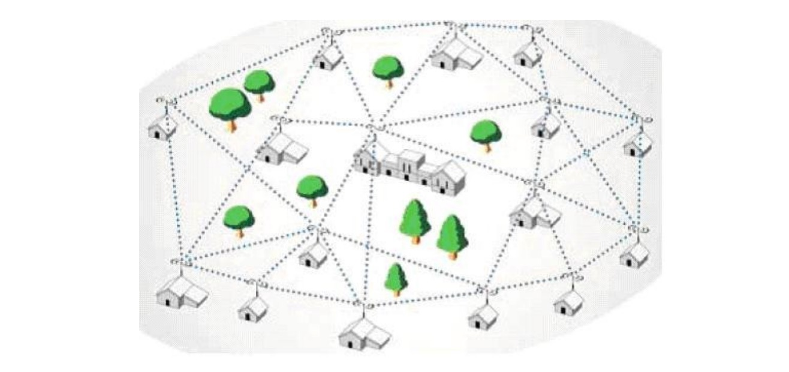
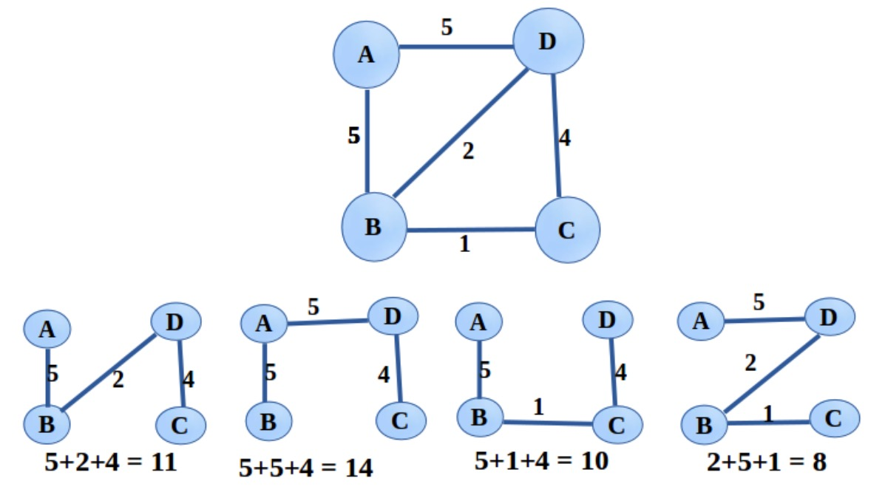
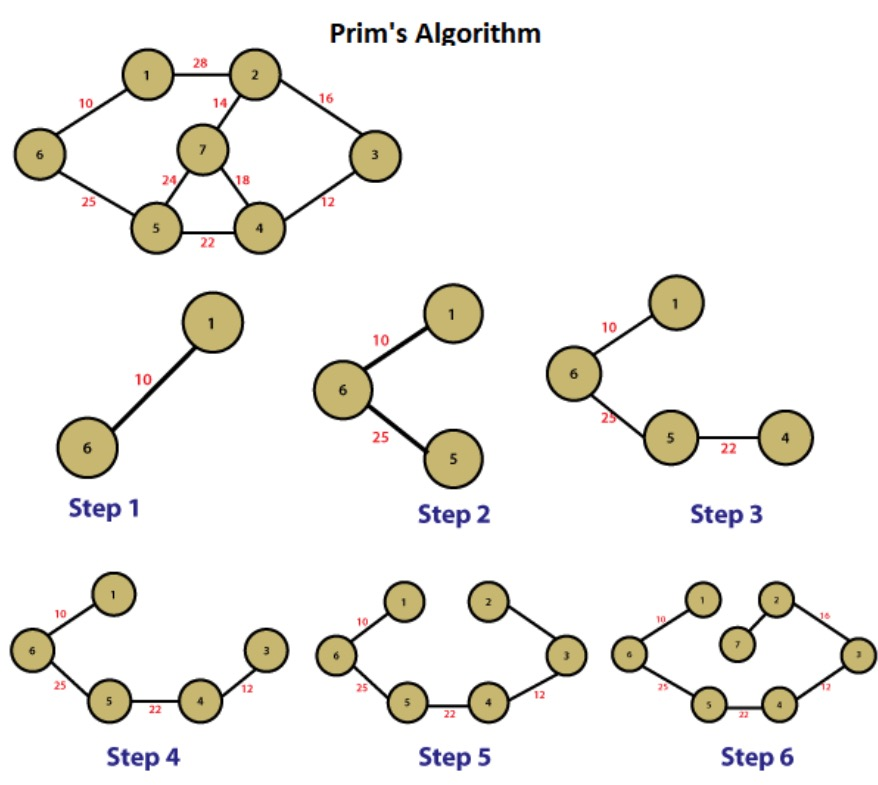
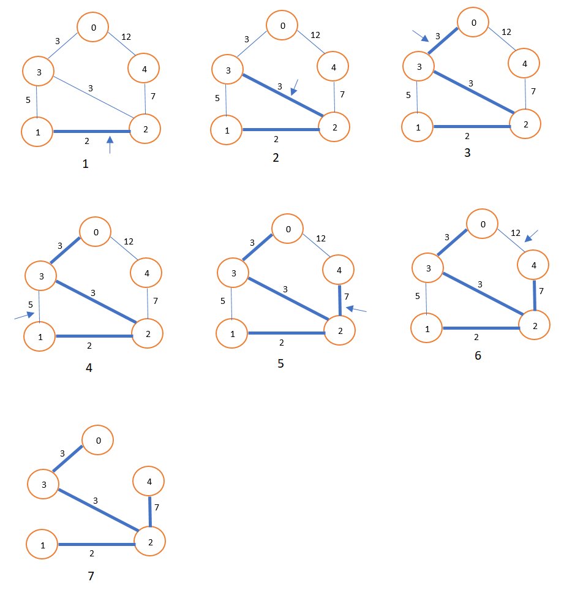

# 最小生成树(Mininum Cost Spanning Tree)

**最小生成树（Minimum Spanning Tree，简称MST）是指包含图中所有顶点的树，且树的边的权重之和最小。换句话说，最小生成树是一棵连接图中所有顶点的无环子图，并且其边的权重之和最小。**

## 最小生成树具有以下特点：
1. 包含图中的所有顶点，但边的数量比原图少。
2. 所有顶点之间通过边连通，且不形成环。
3. 边的权重之和最小，即最小生成树的总权重最小

例如：下面的无向图ABCD四个顶点，可以有四个子树，你认为那个属于最小生成树？

常见的最小生成树算法包括普里姆算法（Prim's Algorithm）和克鲁斯卡尔算法（Kruskal's Algorithm）。这些算法可以帮助找到一个图中的最小生成树，并且保证最小生成树的权重最小。

## 普里姆算法（Prim's Algorithm）

**普里姆算法（Prim's Algorithm）是一种用于求解最小生成树的贪心算法。它从一个起始顶点开始，逐步扩展生成树，直到包含图中的所有顶点为止。普里姆算法的基本思想是通过选择当前生成树和剩余顶点之间具有最小权重的边来逐步扩展生成树。**

### 普里姆算法的步骤：
1. 选择一个起始顶点作为生成树的根节点，并将该顶点标记为已访问。
2. 从已访问的顶点集合中找到与之相邻的边中权重最小的边，并选择连接的顶点作为下一个要访问的顶点。
3. 将选择的边加入生成树，并将连接的顶点标记为已访问。
4. 重复步骤2和步骤3，直到生成树包含图中的所有顶点。

### 优缺点

#### 普里姆算法的优点包括：
1. 算法简单易实现，时间复杂度相对较低。 
2. 适用于稠密图，效果较好。 

#### 普里姆算法的缺点包括：
1. 对于稀疏图来说，效率较低。
2. 对于大规模图来说，算法的运行时间较长

总体而言，普里姆算法是一种常用且有效的最小生成树算法，特别适用于稠密图和小规模问题的求解。

## 克鲁斯卡尔算法（Kruskal's Algorithm）

**克鲁斯卡尔算法（Kruskal's Algorithm）是一种用于求解最小生成树的贪心算法。它通过按权重递增的顺序逐步选择图中的边，将边加入生成树中，直到生成树包含图中的所有顶点为止。克鲁斯卡尔算法的基本思想是先将图中的所有顶点看作独立的树，然后按照边的权重从小到大进行选择，将边连接的两个顶点所在的树合并，直到所有顶点都在同一棵树中。**

### 下面是克鲁斯卡尔算法的步骤：
1. 初始化一个空的最小生成树。
2. 将图中的所有边按照权重从小到大进行排序。
3. 依次遍历排序后的边，如果该边连接的两个顶点不在同一棵树中，则将该边加入最小生成树，并将连接的两棵树合并。
4. 重复步骤3，直到生成树包含图中的所有顶点。

上图中，在步骤4和6加入新的路径时，将会使得生产的最小树变成环形，所以跳过了该路径的加入。

那么，如何判断当加入新的边时，最小生成树为环形？这就要用到了连通分量的概念了

### 连通分量

连通分量是无向图中的一个概念，它指的是图中的一组顶点，其中的任意两个顶点之间存在一条路径。换句话说，连通分量是图中的一部分，其中的顶点相互之间可以通过边相互到达。

在最小生成树的上下文中，连通分量用于判断是否形成了回路。当我们构建最小生成树时，开始时每个顶点都属于自己独立的连通分量。随着逐步添加边到最小生成树中，连接边的两个顶点所属的连通分量会逐渐合并。

在克鲁斯卡尔算法中，如果要添加一条边连接的两个顶点属于不同的连通分量，那么该边可以被添加到最小生成树中，并且将连接的两个连通分量合并成一个连通分量。这样做不会形成回路，因为最小生成树是无环的。如果要添加的边连接的两个顶点已经属于同一个连通分量，那么添加该边将会形成回路，因此在克鲁斯卡尔算法中会跳过该边。

通过使用连通分量来判断是否形成回路，可以确保最小生成树是无环的，因为只有非回路的边才会被添加到最小生成树中，从而保证了生成树的正确性和最小性质。

这里有关于连通分量的说明：[连通分量](https://jasonxqh.github.io/2020/05/15/%E8%BF%9E%E9%80%9A%E5%88%86%E9%87%8F/)

### 优缺点
#### 克鲁斯卡尔算法的优点包括：
1. 算法简单易实现，时间复杂度相对较低。
2. 适用于稀疏图，效果较好。

#### 克鲁斯卡尔算法的缺点包括：
1. 对于稠密图来说，效率较低。
2. 对于大规模图来说，算法的运行时间较长。

总体而言，克鲁斯卡尔算法是一种常用且有效的最小生成树算法，特别适用于稀疏图和小规模问题的求解。
