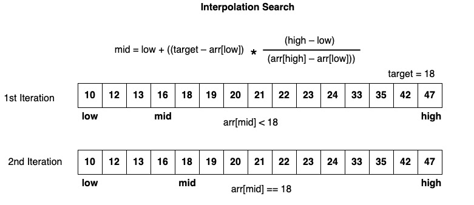
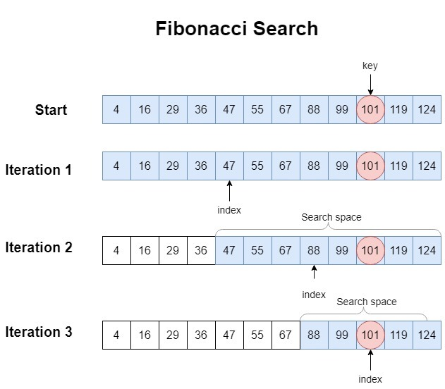

# 查找算法介绍

**查找算法是一种用于在数据集中查找目标元素的算法。它用于确定目标元素是否存在于给定的数据集中，并找到目标元素的位置或其他相关信息。**

常用的查找算法有7种：顺序查找(Sequential Search)、 二分查找(Binary Search)、 插值查找(Interpolation Search)、 斐波那契查找(Fibonacci Search)、
树表查找、分块查找、哈希查找等，其中顺序查找最为简单，此处不在进行赘述，下面我们来看看其他几种查找算法！

## 二分查找(Binary Search)

**二分查找（Binary Search）是一种针对有序数据集的查找算法。它通过将数据集分成两半来快速定位目标元素，然后逐步缩小查找范围，直到找到目标元素或确定目标元素不存在。**

### 二分查找的过程如下：
1. 首先，确定数据集的起始位置和结束位置。
2. 计算数据集的中间位置。
3. 将目标元素与中间位置的元素进行比较：
    - 如果目标元素等于中间位置的元素，则找到目标元素，算法结束。
    - 如果目标元素小于中间位置的元素，则目标元素可能在中间位置的左侧，将结束位置更新为中间位置减一。
    - 如果目标元素大于中间位置的元素，则目标元素可能在中间位置的右侧，将起始位置更新为中间位置加一。
4. 重复步骤2和步骤3，直到找到目标元素或确定目标元素不存在。

### 优缺点
#### 优点包括：
- 时间复杂度为O(log n)，具有较高的查找效率。
- 适用于有序数据集，对于大型数据集的查找速度较快。
- 相对简单，易于实现。

#### 缺点和限制：
- 需要有序的数据集，如果数据集无序，则需要先进行排序操作，增加了额外的时间复杂度。
- 数据集的插入和删除操作比较耗时，因为需要维持有序性。
- 仅适用于静态数据集，即数据集不会频繁变动。

### 适用场景
二分查找在以下情况下适用：
- 数据集有序且静态，不会频繁变动。
- 数据集较大且已排序，需要快速查找目标元素。

常见的应用场景包括在数组、有序列表、二叉搜索树等数据结构中查找特定元素的位置或判断其存在与否。二分查找在搜索性能要求较高、数据集有序且静态的情况下，是一种高效的查找算法。

## 插值查找(Interpolation Search)

**插值查找（Interpolation Search）是一种根据查找键值在有序数据集中的分布情况来预测目标元素位置的查找算法。它是基于二分查找算法的改进，通过插值公式对目标元素的位置进行估计，从而更快地定位目标元素。**

### 插值查找的过程如下：
1. 首先，确定数据集的起始位置和结束位置。
2. 根据目标元素与起始位置和结束位置的关系，使用插值公式计算估计的目标元素位置。
3. 将估计位置与实际位置进行比较：
   - 如果估计位置与实际位置匹配，则找到目标元素，算法结束。
   - 如果估计位置小于实际位置，则目标元素可能在估计位置的右侧，将起始位置更新为估计位置加一。
   - 如果估计位置大于实际位置，则目标元素可能在估计位置的左侧，将结束位置更新为估计位置减一。
4. 重复步骤2和步骤3，直到找到目标元素或确定目标元素不存在。

### 优缺点
#### 优点包括：
- 在数据集分布均匀的情况下，具有较高的查找效率。
- 时间复杂度平均为O(log log n)，相对于二分查找，具有更快的收敛速度。

#### 缺点和限制：
- 对于数据集分布不均匀的情况，查找效率可能不如二分查找。
- 对于较小规模的数据集，插值查找可能没有明显优势，甚至效率更低。

### 适用场景
- 数据集分布均匀，且数据集较大。
- 对于有序的连续数值型数据集，如数值型数组或数值型列表。

插值查找在某些特定的数据分布情况下，可以提供比二分查找更快的查找速度。然而，需要注意的是，对于分布不均匀的数据集，插值查找可能并不是最优选择。因此，在应用插值查找时，需要根据具体情况综合考虑数据分布情况、数据规模和性能要求。

## 斐波那契查找(Fibonacci Search)

**斐波那契查找（Fibonacci Search）是一种利用斐波那契数列进行查找的算法，它是对二分查找的改进。斐波那契查找通过根据查找表的大小动态调整查找范围，提高了查找的效率。**

### 斐波那契查找的过程如下：
1. 首先，创建一个斐波那契数列，并找到大于等于查找表大小的最小斐波那契数。
2. 初始化两个指针：`left`指向查找表的起始位置，`right`指向查找表的结束位置。
3. 比较目标元素与当前指针位置的元素：
   - 如果目标元素等于当前指针位置的元素，则找到目标元素，算法结束。
   - 如果目标元素小于当前指针位置的元素，则目标元素可能在当前指针位置的左侧，将`right`指针更新为当前指针位置的前一个位置，并将查找范围缩小为左侧的子区间。
   - 如果目标元素大于当前指针位置的元素，则目标元素可能在当前指针位置的右侧，将`left`指针更新为当前指针位置的后一个位置，并将查找范围缩小为右侧的子区间。
4. 重复步骤3，直到找到目标元素或确定目标元素不存在。

### 优缺点
#### 优点包括：
- 与二分查找相比，斐波那契查找在某些情况下具有更高的查找效率。
- 时间复杂度为O(log n)，与二分查找相同。

#### 缺点和限制：
- 对于小规模的数据集，斐波那契查找可能没有明显优势，甚至效率更低。
- 实现相对复杂，需要计算和存储斐波那契数列。

### 适用场景
- 数据集规模较大，且数据分布较为均匀。
- 对于有序的连续数值型数据集，如数值型数组或数值型列表。

斐波那契查找在某些特定的数据分布情况下，可以提供比二分查找更快的查找速度。然而，需要注意的是，对于分布不均匀的数据集，斐波那契查找可能并不是最优选择。在应用斐波那契查找时，需要根据具体情况综合考虑数据分布情况、数据规模和性能要求。
