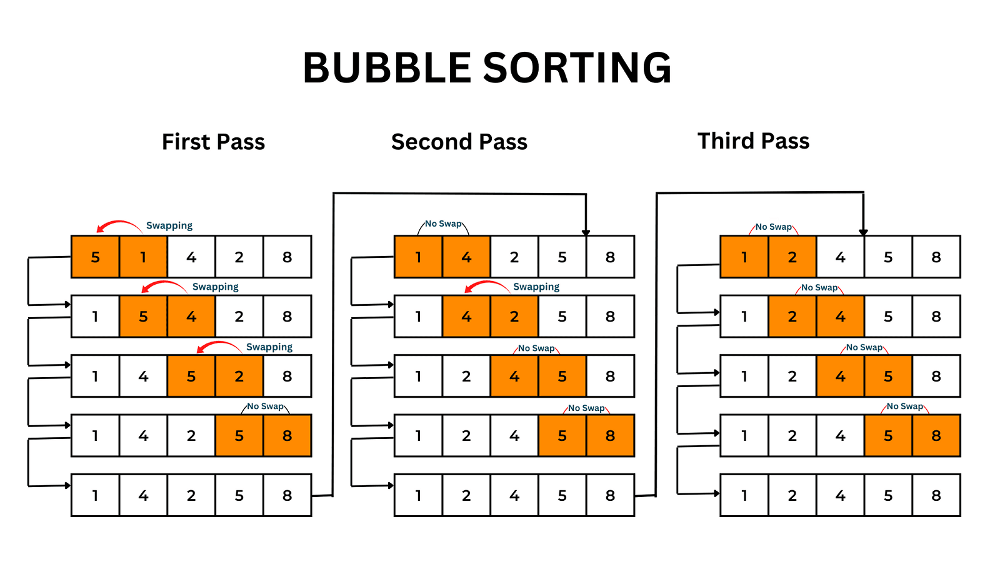

# 排序算法

**排序算法是一种将一组数据按照特定顺序进行排列的算法。**

排序算法是计算机基本问题之一，它在各个领域都有广泛的应用，几乎是现代计算机底层原理的基石，是研究算法的必经之路！

排序算法多种多样，各有特点，主要有7中常见的排序算法：冒泡排序（Bubble Sort）、插入排序（Insertion Sort）、选择排序（Selection Sort）、快速排序（Quick Sort）、归并排序（Merge Sort）、希尔排序（Shell Sort）、桶排序（Bucket Sort）。

下面我们将逐个了解每个算法的特点和过程！

## 冒泡排序（Bubble Sort）

冒泡排序算法是一种简单的排序算法，它重复地比较相邻的两个元素，并按照顺序交换它们，直到整个序列有序为止。

### 冒泡排序的实现过程如下：
1. 从序列的第一个元素开始，依次比较相邻的两个元素，如果它们的顺序不正确，则交换它们的位置，将较大（或较小）的元素“冒泡”到最后（或最前）。
2. 经过第一轮比较后，最大（或最小）的元素已经位于序列的最后（或最前）位置。
3. 重复进行第1和第2步，但每次比较的元素数量都减少1，直到所有元素都排好序。

### 冒泡排序的时间复杂度
冒泡排序的时间复杂度为O(n^2)，其中n是待排序序列的长度。最好情况下，序列已经有序，只需要进行一次扫描，时间复杂度为O(n)。最坏情况下，序列逆序，需要进行n-1轮比较和交换，时间复杂度为O(n^2)。平均情况下，冒泡排序的时间复杂度也为O(n^2)。

### 冒泡排序的优缺点及应用场景
冒泡排序的优点是实现简单，易于理解和编写。同时，冒泡排序是一种稳定的排序算法，相等元素的相对顺序在排序后不会改变。

然而，冒泡排序的缺点是效率较低，尤其在处理大规模数据时。由于需要多次比较和交换，冒泡排序的性能较差。对于逆序序列或基本有序的序列，冒泡排序仍然会进行多余的比较和交换操作，导致性能浪费。

综上所述，冒泡排序适用于数据规模较小或基本有序的情况，对于大规模数据或要求高效排序的场景，更适合选择其他高效的排序算法。

## 选择排序（Selection Sort）

选择排序算法是一种简单的排序算法，它每次从待排序序列中选择最小（或最大）的元素，并将其放置在已排序序列的末尾（或开头），直到整个序列有序为止。

### 选择排序的实现过程如下：
1. 找到序列中最小（或最大）的元素，并将其与序列的第一个元素交换位置。
2. 在剩余的未排序序列中找到最小（或最大）的元素，并将其与序列的第二个元素交换位置。
3. 依次类推，每次从未排序序列中选择最小（或最大）的元素，并将其与已排序序列的下一个位置交换，直到所有元素都排好序。

### 选择排序的时间复杂度
选择排序的时间复杂度为O(n^2)，其中n是待排序序列的长度。无论序列的初始状态如何，选择排序都需要进行n-1轮比较和交换操作。每一轮中，需要在未排序序列中选择最小（或最大）的元素，然后与已排序序列的下一个位置交换。这种固定的比较和交换操作导致选择排序的时间复杂度始终为O(n^2)。

### 选择排序的优缺点及应用场景
选择排序的优点是实现简单，易于理解和编写。它是一种稳定的排序算法，相等元素的相对顺序在排序后不会改变。

然而，选择排序的缺点是效率较低，尤其在处理大规模数据时。由于需要多次比较和交换，选择排序的性能较差。与冒泡排序类似，选择排序在每一轮中只能确定一个元素的最终位置，而不是一次性确定整个序列的有序性。

综上所述，选择排序适用于数据规模较小或基本有序的情况，对于大规模数据或要求高效排序的场景，更适合选择其他高效的排序算法。

## 插入排序（Insertion Sort）

插入排序算法是一种简单直观的排序算法，它将待排序序列分为已排序和未排序两部分，每次从未排序部分中选择一个元素插入到已排序部分的适当位置，直到所有元素都被插入为止。

### 插入排序的实现过程如下：
1. 从第二个元素开始，将其视为已排序部分。
2. 依次将未排序部分的元素与已排序部分的元素进行比较，找到合适的位置插入。
3. 插入元素后，已排序部分长度增加一，并将插入位置后的元素向后移动一个位置。
4. 重复上述步骤，直到所有元素都被插入到合适的位置。

### 插入排序的时间复杂度
插入排序的时间复杂度为O(n^2)，其中n是待排序序列的长度。在最坏情况下，即待排序序列逆序时，插入排序需要进行大量的比较和移动操作。每次插入一个元素时，需要与已排序部分的元素逐个比较并移动，因此平均情况下每个元素需要比较和移动的次数都是线性的，导致总的时间复杂度为O(n^2)。

### 插入排序的优缺点及应用场景
插入排序的优点是实现简单，易于理解和编写。它是一种稳定的排序算法，相等元素的相对顺序在排序后不会改变。另外，插入排序对于部分有序的序列具有较好的性能。

然而，插入排序的缺点是对于大规模乱序的数据排序效率较低。在每次插入一个元素时，需要与已排序部分的元素逐个比较和移动，因此插入排序的性能与待排序序列的初始状态密切相关。当数据规模较大且乱序程度较高时，插入排序的性能较差。

综上所述，插入排序适用于数据规模较小或基本有序的情况，对于大规模乱序的数据或要求高效排序的场景，更适合选择其他高效的排序算法。

## 快速排序（Quick Sort）

快速排序算法是一种常用的排序算法，它基于分治法的思想，通过将待排序序列分割成较小的子序列，然后分别对子序列进行排序，最终将整个序列排序完成。

### 快速排序的实现过程如下：
1. 选择一个元素作为基准值（通常选择第一个元素）。
2. 将序列分割成两部分，使得左边的元素都小于等于基准值，右边的元素都大于等于基准值。这个过程称为分区操作（partition）。
3. 对左右两个子序列分别进行递归调用快速排序。
4. 重复上述步骤，直到子序列的长度为1或为空。

### 快速排序的时间复杂度
快速排序的时间复杂度为平均情况下的O(nlogn)，其中n是待排序序列的长度。在最坏情况下，即每次划分只能将序列划分成长度为1和n-1的两个子序列时，快速排序的时间复杂度为O(n^2)。然而，通过合理选择基准值和优化分区操作，可以降低最坏情况下的发生概率。

### 快速排序的优缺点及应用场景
快速排序的优点是实现简单、适用范围广，并且在平均情况下具有较好的性能。它是一种原地排序算法，不需要额外的存储空间。快速排序也是一种稳定的排序算法，相等元素的相对顺序在排序后不会改变。

然而，快速排序的缺点是在最坏情况下性能较差，并且对于包含大量重复元素的序列，可能出现分割不均匀的情况，导致递归调用的层数过多，影响性能。为了解决这个问题，可以采用随机选择基准值或者使用三数取中法等方法来选择基准值，以提高分割的均匀性。

综上所述，快速排序适用于大规模乱序的数据排序，对于较小规模的数据或基本有序的序列，其他算法可能更为适合。

## 归并排序（Merge Sort）

快速归并算法是一种基于归并排序和快速排序的混合排序算法。它通过结合归并排序的稳定性和快速排序的划分能力，提供了一种高效的排序方法。

### 实现过程如下：
1. 首先，将待排序序列分割成较小的子序列，通常采用递归的方式进行分割，直到子序列的长度为1。
2. 接下来，将相邻的子序列两两合并，通过比较元素的大小，将它们按照顺序合并成更大的有序子序列。这一步骤类似于归并排序的合并操作。
3. 重复执行上述合并操作，直到所有子序列合并为一个完整的有序序列。

### 时间复杂度
快速归并排序的时间复杂度为O(nlogn)，其中n是待排序序列的长度。由于采用了归并排序的思想，快速归并排序保证了稳定性，相等元素的相对顺序在排序后不会改变。

### 优缺点及应用场景
快速归并排序的优点是具有较好的平均性能和稳定性，避免了快速排序在最坏情况下的性能下降。它能够处理大规模乱序的数据，并且对于包含重复元素的序列也能够有效排序。

然而，快速归并排序的缺点是需要额外的存储空间来存储临时数组，增加了空间复杂度。此外，由于递归的使用，可能存在函数调用栈的开销，对于极大规模的数据排序可能会导致栈溢出。

综上所述，快速归并排序是一种高效而稳定的排序算法，适用于大规模乱序数据的排序需求。

## 希尔排序（Shell Sort）

希尔排序算法是一种插入排序的改进算法，也被称为缩小增量排序。它通过将待排序序列分割成多个较小的子序列来进行排序，逐步减小子序列的长度，最终完成整个序列的排序。

### 实现过程如下：
1. 首先，选择一个增量序列，通常是一系列递减的整数，称为增量。增量序列的选择是希尔排序的关键。
2. 将待排序序列按照增量进行分组，分成多个子序列。
3. 对每个子序列进行插入排序，即使用插入排序算法对子序列进行排序。
4. 缩小增量，重复步骤2和步骤3，直到增量为1。
5. 最后，对整个序列进行一次插入排序。

### 时间复杂度
希尔排序的时间复杂度是根据增量序列的选择而变化的，最好情况下可以达到O(nlogn)，最坏情况下为O(n^2)。一般情况下，希尔排序的时间复杂度介于O(nlogn)和O(n^2)之间。

### 优缺点及应用场景
希尔排序的优点是相对于插入排序来说，它在大规模乱序的数据中表现较好，能够更快地将较小的元素移动到合适的位置，从而减少了后续插入排序的次数。希尔排序也是一种原地排序算法，只需使用常数级的额外空间。

然而，希尔排序的增量序列的选择对算法的性能影响较大，不同的增量序列可能会导致不同的时间复杂度。同时，希尔排序不是稳定的排序算法，相等元素的相对顺序可能会改变。

综上所述，希尔排序是一种高效的排序算法，在某些情况下能够比插入排序和选择排序更快地完成排序任务，但是对于较大规模的数据和对稳定性要求较高的情况，可能不是最佳选择。

## 桶排序（Bucket Sort）

桶排序算法是一种排序算法，它通过将待排序的元素分到不同的桶中，对每个桶中的元素进行排序，最后将桶中的元素按顺序合并，得到排序后的结果。

### 实现过程如下：
1. 确定桶的数量和范围。根据待排序元素的范围和数量，确定需要的桶的数量，每个桶表示一个区间范围。
2. 将待排序元素分配到对应的桶中。遍历待排序元素，根据元素的值将其分配到对应的桶中。
3. 对每个桶中的元素进行排序。可以使用任何一种排序算法对每个桶中的元素进行排序，也可以递归地使用桶排序算法对每个桶进行排序。
4. 合并桶中的元素。按照桶的顺序，将每个桶中的元素合并到一个新的数组中，得到排序后的结果。

### 时间复杂度
桶排序的时间复杂度取决于对每个桶中元素的排序算法的选择，通常情况下可以认为是O(n+k)，其中n是待排序元素的数量，k是桶的数量。如果每个桶中的元素数量平均分布，则桶排序的复杂度可以近似为O(n)。
桶排序是一种典型的通过空间换时间的算法！

### 优缺点及应用场景
桶排序的优点是对于一定范围内的元素排序效果较好，可以在一定程度上减少比较和交换的次数。它适用于待排序元素分布均匀的情况，可以在线性时间内完成排序。

然而，桶排序的缺点是对于数据分布不均匀的情况下，可能会导致一些桶中的元素数量过多或过少，从而影响排序效率。此外，桶排序需要额外的空间来存储桶和合并结果，因此在内存有限的情况下，可能会受到空间限制。

综上所述，桶排序是一种高效的排序算法，适用于一定范围内数据分布较均匀的情况。它的时间复杂度较低，但对于数据分布不均匀或空间有限的情况，可能不是最佳选择。
