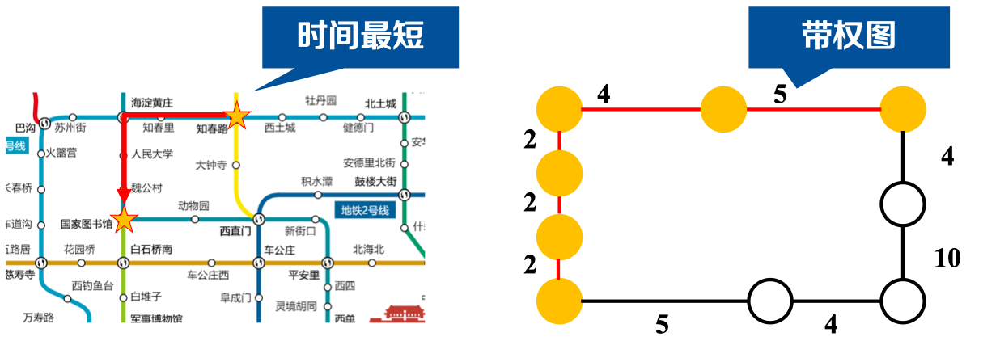
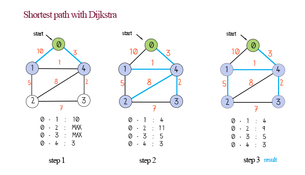
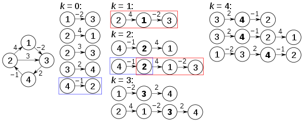

# 最短路径算法

**图的最短路径问题是指在一个图中寻找两个顶点之间的最短路径，即路径上的边权重之和最小的路径。这个问题在图论中是一个经典的问题，有许多著名的算法用于解决最短路径问题。**

## 最短路径问题有两种常见的形式：
1. **单源最短路径问题（Single-Source Shortest Path Problem）**：给定一个图和一个起始顶点，要求找到从起始顶点到图中所有其他顶点的最短路径。
2. **多源最短路径问题（All-Pairs Shortest Path Problem）**：给定一个图，要求找到图中任意两个顶点之间的最短路径。

最短路径问题的解决方法有多种，下面我们就来了解一下：

## 常见的算法包括：
- **迪杰斯特拉算法（Dijkstra's Algorithm）**：适用于解决单源最短路径问题，可以在非负权重的有向图或无向图中找到最短路径。
- **弗洛伊德算法（Floyd-Warshall Algorithm）**：适用于解决多源最短路径问题，可以在有向图或无向图中找到任意两个顶点之间的最短路径。
- **贝尔曼-福特算法（Bellman-Ford Algorithm）**：适用于解决单源最短路径问题，可以处理带有负权边的有向图或无向图。
- **A*算法（A-Star Algorithm）**：适用于解决单源最短路径问题，结合了迪杰斯特拉算法和启发式搜索的思想，在具有启发函数的图中找到最短路径。

## 迪杰斯特拉算法（Dijkstra's Algorithm）

迪杰斯特拉算法（Dijkstra's Algorithm）是一种用于解决单源最短路径问题的图算法。它可以在带有非负权重的有向图或无向图中找到从一个起始顶点到所有其他顶点的最短路径。

### 迪杰斯特拉算法的求解步骤如下：
1. 创建一个距离表（Distance Table），用于记录每个顶点到起始顶点的距离。初始时，起始顶点的距离为0，其他顶点的距离设为无穷大。
2. 创建一个集合来保存已经确定最短路径的顶点，初始时为空集。
3. 重复以下步骤，直到集合中包含了所有顶点：
    - 从未确定最短路径的顶点中选择距离最小的顶点，将其添加到集合中，并标记为已确定最短路径。
    - 更新与该顶点相邻的顶点的距离。如果经过当前顶点到达相邻顶点的路径比原来的路径短，则更新距离表中的值。
4. 完成后，距离表中记录的就是从起始顶点到每个顶点的最短距离。

### 优缺点

**迪杰斯特拉算法的优点包括：**
- 可以找到单源最短路径问题的最优解，确保找到每个顶点的最短路径。
- 对于非负权重的图，算法的时间复杂度较低，通常为 O(|V|^2)，其中 |V| 表示顶点数。

**迪杰斯特拉算法的缺点包括：**
- 无法处理负权边的图，因为算法基于贪心策略，每次选择距离最小的顶点，而负权边可能导致循环路径的出现。
- 对于大规模图的计算开销较大，时间复杂度较高。
- 算法中需要维护距离表和集合，需要额外的存储空间。

迪杰斯特拉算法在许多领域有广泛应用，例如路由算法、网络优化、地图导航等。它能够在图中找到最短路径，帮助解决许多实际问题。但需要注意算法的局限性，特别是在处理负权边或大规模图时需要考虑其他算法的选择。

## 弗洛伊德算法（Floyd-Warshall Algorithm）

弗洛伊德算法（Floyd-Warshall Algorithm）是一种用于解决全源最短路径问题的图算法。它可以在带有正或负权重的有向图或无向图中找到任意两个顶点之间的最短路径。

### 弗洛伊德算法的求解步骤如下：
1. 创建一个距离矩阵（Distance Matrix），用于记录任意两个顶点之间的距离。初始时，距离矩阵的值为两个顶点之间的边权重，如果两个顶点之间没有直接边，则距离设为无穷大。
2. 通过对距离矩阵进行迭代更新，逐步找到更短的路径：
   - 对于每一对顶点 i 和 j，以及每一个中间顶点 k，在距离矩阵中比较当前的距离矩阵值和通过中间顶点 k 经过的路径的距离，如果后者更短，则更新距离矩阵中的值为较小的距离。
   - 重复以上步骤，通过不断更新距离矩阵，最终得到任意两个顶点之间的最短路径。
3. 完成后，距离矩阵中记录了任意两个顶点之间的最短距离。

### 优缺点

**弗洛伊德算法的优点包括：**
- 可以找到全源最短路径问题的最优解，即找到任意两个顶点之间的最短路径。
- 对于带有正或负权重的图，算法都能正确运行，并给出最短路径。
- 不需要事先知道起始顶点，可以计算任意两个顶点之间的最短路径。

**弗洛伊德算法的缺点包括：**
- 时间复杂度较高，通常为 O(|V|^3)，其中 |V| 表示顶点数。对于大规模图来说，计算开销较大。
- 算法中需要维护距离矩阵，需要额外的存储空间。

弗洛伊德算法常用于解决图中所有顶点之间的最短路径问题，例如在网络路由算法、传感器网络、动态规划等领域应用广泛。它的能力在于计算出任意两个顶点之间的最短路径，并且可以应对带有负权边的情况。然而，对于大规模图和时间敏感的应用，可能需要考虑其他更高效的算法。

## 总结
最短路径问题在实际应用中具有广泛的应用，例如路由算法、地图导航、网络优化等领域。通过寻找图中的最短路径，可以帮助我们在各种场景下找到最优的路径选择。
