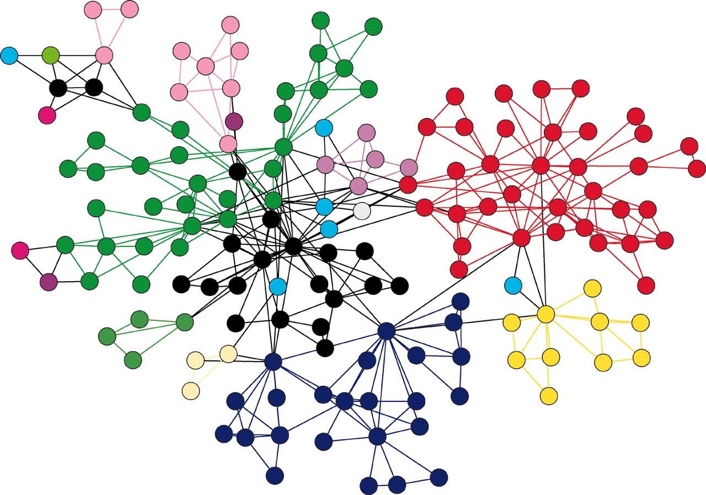
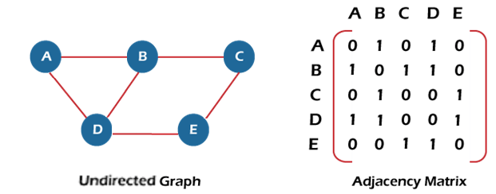
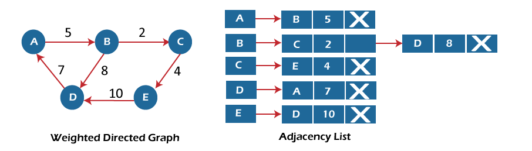

# 图

**图是一种非线性的数据结构，用于表示元素之间的关系。它由节点（顶点）和连接节点的边组成。图用于描述实际生活中各种复杂的关系和网络结构，如社交网络、地图路线、计算机网络等。**

## 为什么需要图？

前面我们学习线性表和树结构的时候，都局限于一个前驱节点和后驱节点的关系，无法表示多对多的关系，比如社交网络等，此时，图将成为最佳选择。

## 图的基本概念

1. **节点（顶点）**：图中的元素，可以表示实体或抽象概念。每个节点可以有一个或多个属性，如标签、值等。
2. **边**：节点之间的连接线，表示节点之间的关系。边可以是有向的（有箭头指向）或无向的（双向连接）。
3. **权重**：边可以带有权重，表示节点之间的距离、成本或其他度量。
4. **路径**：图中节点的序列，通过边连接起来形成的路径。路径可以是有向的或无向的。
5. **连通性**：指示图中节点之间是否存在路径，从一个节点可以到达另一个节点。
6. **环**：在有向图中，存在一个节点的路径，使得路径的起点和终点为同一个节点。

## 图可以分为以下几类：
1. **有向图（Directed Graph）**：图中的边具有方向，表示从一个节点到另一个节点的单向连接。
2. **无向图（Undirected Graph）**：图中的边没有方向，表示节点之间的双向连接。
3. **加权图（Weighted Graph）**：图中的边带有权重，表示节点之间的距离、成本或其他度量。
4. **有向加权图（Directed Weighted Graph）**：具有方向和权重的图。
5. **无向加权图（Undirected Weighted Graph）**：没有方向但具有权重的图。
6. **有向无环图（Directed Acyclic Graph，DAG）**：无环的有向图，不存在从某个节点出发经过若干边后回到该节点的路径。
7. **树（Tree）**：一种特殊的无环无向图，具有层级结构，其中一个节点被指定为根节点。

这些基本概念和分类可以帮助我们理解和描述图这种数据结构，并为解决实际问题提供了丰富的工具和算法。图广泛应用于网络分析、路由算法、图像处理、推荐系统等领域。

## 图的基本表示方法

通常，图的表示方法有三种：邻接矩阵，邻接表，路径集合，下面我们展开来看看：

### 邻接矩阵

邻接矩阵是表示图形中顶点之间相邻关系的矩阵，对于n个顶点的图而言，矩阵的row和col表示的是1...n个点。

使用二维矩阵表示图的连接关系，直观且易于理解。查找两个节点之间是否有边的关系的时间复杂度为O(1)。

**但是缺点非常突出：**
1. 占用空间较大，尤其当图规模较大时。对于稀疏图（边的数量相对于节点数量较少）来说，会浪费大量的空间。
2. 新增节点和删除节点时需要移动和重构数组，效率较低。
3. 无法进行面向对象进行设计，在实际场景中，和业务对象关联较低。

### 邻接表

邻接表可以看做是数组+链表的方式来实现，只关系存在的边，不关心不存在的边。

所以，优点是使用链表或数组的方式表示节点和其邻接节点的关系，节省空间。对于稀疏图，邻接表可以更好地优化空间利用。

**但是缺点也很明显：**
1. 在查找两个节点之间是否有边的关系时，需要遍历链表或数组，时间复杂度为O(n)，其中n是节点的平均度数
2. 无法进行面向对象进行设计，在实际场景中，和业务对象关联较低。

### 边列表

从另一个角度来看，图是由很多边组成的，每个边包括起始位置和结束位置，起始位置和结束位置互相链接就形成了图。所以图可以有一个边的列表来表示。

这种表示方法的优势非常明显：
1. 只表示存在的边，不表示不存在的边，没有空间浪费。
2. 数据结构可以使用列表来存储边，新增和删除非常容易。
3. 能够进行面向对象设计，不管是用广度优先还是深度优先算法，实现起来都比较容易。

## 图的基本算法

图的算法有两个基本算法: 深度优先算法（Depth-First Search，DFS）和广度优先算法（Breadth-First Search，BFS）是常用的图遍历算法，用于遍历图中的节点。

### 深度优先算法（DFS）的过程如下：
1. 从图中选择一个起始节点作为当前节点，并将其标记为已访问。
2. 访问当前节点，并对其邻接节点进行递归遍历。
3. 递归遍历的规则是：对于当前节点的未访问邻接节点，选择一个邻接节点作为新的当前节点，并进行相同的递归遍历操作。
4. 如果当前节点没有未访问的邻接节点，则回溯到上一个节点，并选择另一个未访问的邻接节点作为新的当前节点。
5. 重复步骤2和步骤3，直到所有节点都被访问。

### 广度优先算法（BFS）的过程如下：
1. 从图中选择一个起始节点作为当前节点，并将其标记为已访问。
2. 将当前节点加入队列。
3. 从队列中取出一个节点作为当前节点，并访问该节点。
4. 遍历当前节点的所有邻接节点，如果邻接节点未被访问过，则将其标记为已访问，并将其加入队列。
5. 重复步骤3和步骤4，直到队列为空。

深度优先算法通过递归的方式深入探索图的路径，直到到达最深的节点，然后回溯到上一个节点继续探索其他路径。深度优先算法通常使用栈来实现递归调用的过程。

广度优先算法则通过队列的方式逐层遍历图的节点，先访问起始节点的所有邻接节点，然后访问邻接节点的邻接节点，依次进行层级遍历。广度优先算法通常使用队列来保存待访问的节点。

深度优先算法和广度优先算法在遍历过程中可以用于查找路径、连通性判断、寻找最短路径等问题，具体的应用取决于实际需求和问题的性质。
