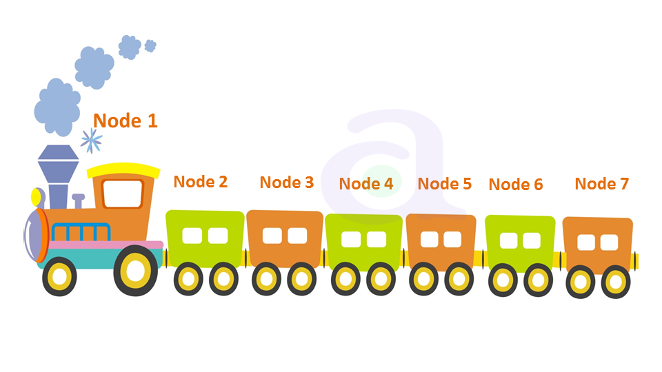

# 链表

链表（Linked List）是一种常见的数据结构，它通过指针将一组零散的内存块串联起来使用，通常用于存储有序的数据。

### 链表的特点：
* 链表中的每个元素都由一个节点（Node）表示，每个节点包含两个部分：数据部分和指针部分。
* 每个节点的指针指向下一个节点，这样就构成了一个链表。
* 链表可以动态扩展，因为节点是可以动态创建和删除的。
* 在链表中插入和删除元素非常方便，因为只需要修改相邻节点的指针即可，不需要像数组那样搬移大量数据。

### 与数组的区别：
* 数组中的元素在内存中是连续的，而链表中的元素是不连续的，它们通过指针来连接。
* 数组的元素个数固定，而链表的元素个数可以动态变化。
* 在数组中插入和删除元素时，需要搬移大量的数据，时间复杂度为O(n)，而在链表中插入和删除元素非常方便，时间复杂度为O(1)。但是在访问链表中的元素时，需要遍历链表，时间复杂度为O(n)，而数组中可以通过下标来直接访问元素，时间复杂度为O(1)。

因此，链表适合频繁进行插入和删除操作，而数组适合频繁进行随机访问。

## 链表的分类

链表可分为单向链表、双向链表、循环链表等几种类型。

### 单链表

单链表是一种常见的数据结构，它由节点（Node）组成，每个节点包含两部分信息：数据和指针（存放下一个节点的地址）。通过将每个节点的指针域指向下一个节点的地址，从而将所有的节点连接起来形成链表。

**单链表的特点：**
* 单链表的每个节点只包含一个后继指针；
* 单链表的头结点和尾结点比较特殊，头结点用来记录链表的基地址，是链表遍历的起点，尾结点的后继指针不指向任何结点，而是指向一个空地址NULL。
* 单链表的插入、删除操作时间复杂度为O(1)，随机查找时间复杂度为O(n)。

**单链表的缺点：**
* 无法直接访问链表中间的元素，必须从头节点开始遍历，直到找到目标节点，因此访问元素的时间复杂度为O(n)。
* 单链表不能反向遍历，因为它只有一个方向的引用，所以如果需要反向遍历，需要重新创建一个反向的链表。
* 在删除某个节点时，需要找到其前驱节点，将其前驱节点的指针指向其后继节点，因此需要遍历到该节点的前一个节点，时间复杂度为O(n)。
* 单链表的空间利用率较低，因为它需要额外的空间来存储节点之间的指针。
* 单链表的节点不是连续存储的，因此不能像数组那样利用CPU缓存，这也导致了单链表的性能相对较低。

### 双向链表

双向链表（Doubly linked list）是一种链式数据结构，每个节点除了存储一个值（或称为键、关键字等）外，还存储两个指向前驱节点和后继节点的指针，因此可以双向遍历链表。

相较于单链表，双向链表的优点在于它每个节点除了有指向后继节点的指针，还有指向前驱节点的指针。因此，在双向链表中，除了可以向前遍历节点，还可以向后遍历节点，这使得双向链表可以更方便地实现一些特定的操作，如双向遍历、在某个节点处插入或删除节点等。此外，双向链表对于某些问题的解决方案要比单链表更加简单和高效。但是，相对于单链表，双向链表每个节点需要维护两个指针，因此需要更多的存储空间。

### 循环链表

循环链表是一种特殊的链表，它和单链表的区别在于它的最后一个节点指向头节点，形成一个环。

循环链表相对于单链表的优点在于，它能够方便地实现环形结构，可以用于解决一些循环遍历的问题。例如，用循环链表实现的约瑟夫环问题，就是一个很好的例子。

同时，循环链表的操作和单链表基本相同，只是需要注意在遍历和插入、删除节点时需要特别处理环的问题.

## 链表的应用场景

链表在实际中有很多应用场景，以下是一些常见的应用场景：

1. 实现数据结构：链表是一种常见的数据结构，用于实现栈、队列、哈希表等。
2. 内存分配：操作系统在管理内存时，使用链表来跟踪可用内存块和已使用内存块。
3. 图形学：在计算机图形学中，链表被广泛用于表示三维物体中的面、边和顶点。
4. 文字处理：在文字处理软件中，链表被用于实现撤销操作。
5. 垃圾回收：在垃圾回收中，链表用于跟踪未使用的内存块。
6. 线性代数：在线性代数中，链表用于表示稀疏矩阵。

总之，链表是一种非常常见的数据结构，其应用非常广泛，可以在各种不同的场景下使用。

### 经典应用场景： LRU 缓存淘汰算法

缓存是一种提高数据读取性能的技术，在硬件设计、软件开发中都有着非常广泛的应用，比如常见的CPU缓存、数据库缓存、浏览器缓存等等。

缓存空间的大小有限，当缓存空间被用满时，哪些数据应该被清理出去，哪些数据应该被保留？这就需要缓存淘汰策略来决定。常见的缓存清理策略有三种：
* 先进先出策略FIFO（First In, First Out）
* 最少使用策略 LFU（Least Frequently Used）
* 最近最少使用策略LRU（Least Recently Used）。

如何用链表来实现LRU缓存淘汰策略呢？

思路：维护一个有序单链表，越靠近链表尾部的结点是越早之前访问的。当有一个新的数据被访问时，我们从链表头部开始顺序遍历链表。
* 如果此数据之前已经被缓存在链表中了，我们遍历得到这个数据的对应结点，并将其从原来的位置删除，并插入到链表头部。
* 如果此数据没在缓存链表中，又可以分为两种情况处理：
  * 如果此时缓存未满，可直接在链表头部插入新节点存储此数据；
  * 如果此时缓存已满，则删除链表尾部节点，再在链表头部插入新节点。
