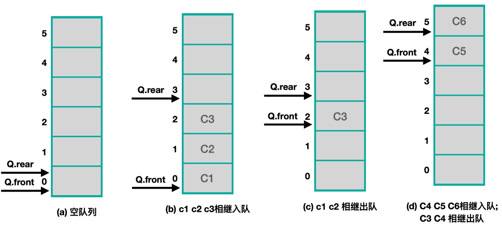
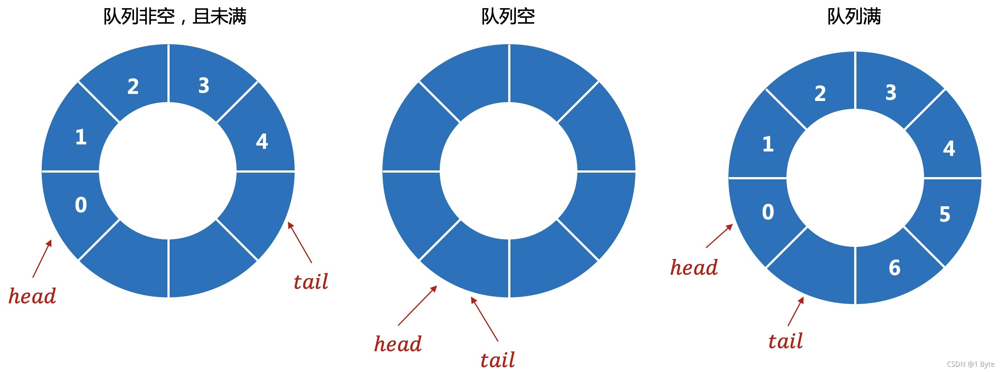

# 队列

队列是一种具有先进先出（FIFO）的数据类型，可以使用多种数据结构来实现队列：数组和链表。

其中，链式表示方式的队列用链表实现。若用户无法预估队列的具体长度，那么用链队列是比较方便的，因为链表的好处就是可以很方便地添加和删除新的节点。但我们也知道链表在添加节点的时候需要动态分配内存，这个过程是比较耗费资源和时间的。

如果我们的队列长度固定，又想要有较高的性能，那么就可以用顺序表示方式的队列，此时数组是最佳选择。

## 数据队列的假溢出现象

提起顺序的数据结构，大家可能首先想到了数组。那么我们能不能用正常意义上的数组实现顺序队列呢？答案是不好实现，原因就是所谓的“假溢出”现象。

系统作为队列用的存储区还没有满，但队列却发生了溢出，我们把这种现象称为"假溢出"。

如上图所示，front表示队头，rear表示队尾。
* a: 一个空队列，此时front和rear均指向初始的0号位置；
* b: 将c1、c2、c3三个元素入队，此时front指针并未移动，rear指针移动到了3号位；
* c: c1、c2俩元素相继出队，此时队尾指针rear并未移动，队首front指针移动到了2号位；
* d: 表示入队与出队同时进行的操作，c4、c5、c6相继入队，c3、c4相继出队，此时front移动到了4号位，rear指针按道理应该移动到6号位，但是我们这个队列没有6号位，所以rear指针就停留在了队列的最末端。

假溢出问题怎么解决呢？一种方法是每次队首的元素被取出时候，剩余所有的元素都往前平移一个单位。但是这种方式太过于耗费性能，数组最不擅长删除元素，与其用这种方式实现顺序队列，还不如直接用链式队列。

还有一种方法就比较巧妙了：将数组的首尾相连，组成一个逻辑上的“循环队列”。

## 循环队列

循环队列其实就是将数组的首尾相连，组成的一个特殊结构。我们用两个指针来表示队列的队首和队尾，head表示队首的元素，tail表示队尾的下一个元素。这里的数组“尾部”的下一个元素就是“首部”，这样就可以很好避免了假溢出的问题。
