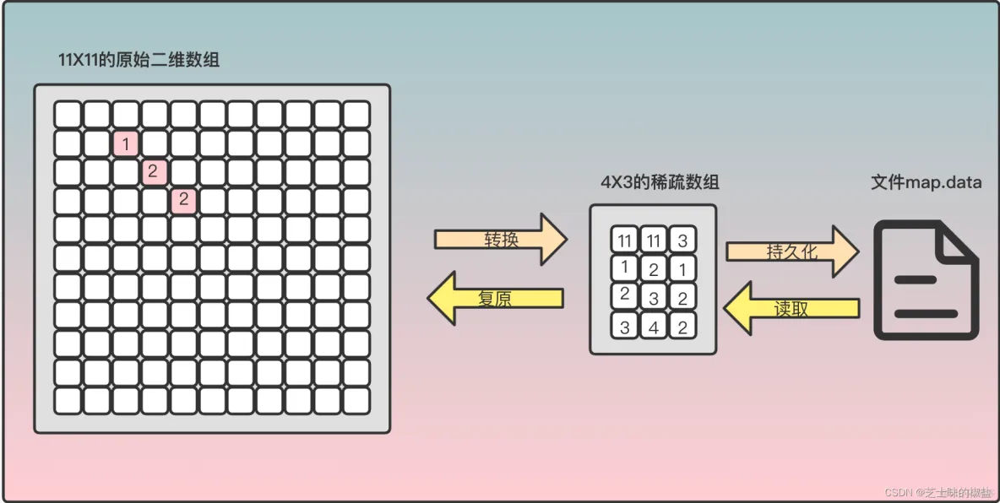

# 稀疏数组

稀疏数组是一种用于存储大部分元素为零的二维数组的压缩方法。它通过记录数组中所有非零元素的位置和值来减少存储空间的使用。具体而言，稀疏数组包括三列，分别是非零元素所在的行数、列数和元素值。

稀疏数组的作用在于可以有效地压缩大规模稀疏矩阵的存储空间。在实际应用中，大部分矩阵都是稀疏的，因此使用稀疏数组可以大大减少存储空间的使用，提高算法的效率。例如，搜索引擎中的倒排索引、计算机图形学中的稀疏矩阵等应用都需要使用稀疏数组来存储数据。

使用场景包括但不限于：

* 大规模矩阵的存储和计算，例如计算机图形学中的图像处理和渲染、搜索引擎中的倒排索引等。
* 网络通信中的数据传输，例如通过网络传输大型稀疏矩阵时，使用稀疏数组可以减少数据传输量。
* 数据库中的索引，例如使用稀疏数组来存储索引可以减少索引的存储空间和查询时间。

总之，稀疏数组是一种非常实用的数据结构，可以在很多场景下提高算法的效率和性能。

虽然稀疏数组在处理大规模稀疏矩阵时可以有效地减少存储空间的使用，但在以下情况下可能不推荐使用稀疏数组：

* 稠密矩阵：如果矩阵中大多数元素都不是零，那么使用稀疏数组可能不会带来存储空间的明显减少，反而可能会浪费空间。
* 频繁地插入、删除元素：稀疏数组在插入、删除元素时需要进行大量的移动操作，导致效率较低，因此不适合频繁地插入、删除元素的场景。
* 读取非零元素的效率较低：由于稀疏数组需要在多个位置上存储元素的行列信息和值信息，因此读取非零元素的效率可能会低于直接读取稠密数组中的元素。
* 内存不受限制：如果内存空间不受限制，那么使用稀疏数组可能不会带来明显的好处，因为存储空间的优势可能被抵消。

总之，稀疏数组适用于大规模稀疏矩阵的存储和处理，但在其他情况下可能不是最优选择。在具体应用时，需要根据数据的特点和应用场景综合考虑，选择合适的数据结构来实现需求。
