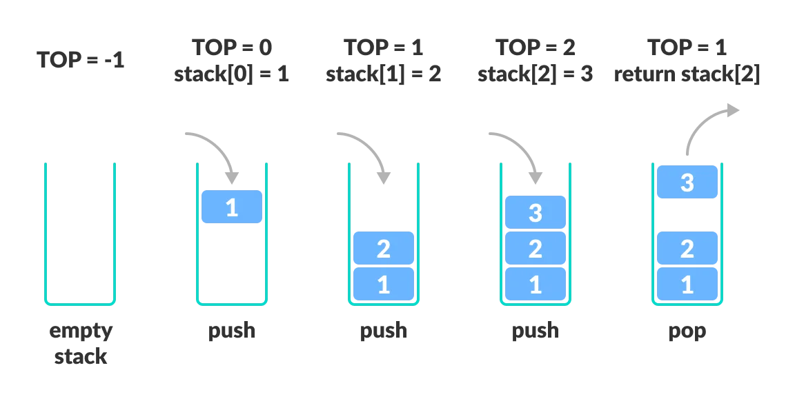

# 栈

**栈是一种先入后出（LIFO）的数据结构，它是一种只能在一端进行插入和删除操作的线性表。**

栈的基本概念：栈通常包含两个主要操作：压入(push)和弹出(pop)。压入操作在栈的顶部插入一个新元素，弹出操作则从顶部删除元素。栈顶是最后进栈的元素，栈底是最先进栈的元素。

栈的特点：栈具有后进先出的特点，也就是越靠近栈顶的元素越新，越靠近栈底的元素也越旧。栈具有高效的插入、删除操作，不需要移动其它元素就可以删除栈顶元素。

栈的使用场景：栈在计算机科学中非常广泛，通常用于处理递归调用、语法分析、表达式求值等。
在操作系统中，栈被用来存储函数调用的参数、返回地址和局部变量等。
在编译器中，栈用于存储临时变量和函数调用的参数等。在操作系统内存管理中，栈用于存储当前进程的状态、上下文和返回地址等。
在图形处理中，栈被用于实现撤销和重做功能等。因此，栈可以说是一种非常有用的数据结构。

## 中缀与后缀表达式

中缀表达式是人们常见的运算表达式形式，例如"3 + 4"就是一个中缀表达式。中缀表达式的特点是运算符在运算数之间，需要使用括号来明确表达式的优先级。但是，中缀表达式在计算机程序中不方便处理。

后缀表达式（也称为逆波兰表达式）是一种没有括号的表达式，它将运算符放在运算数之后，例如"3 4 +"就是一个后缀表达式。在后缀表达式中，每个运算都可以直接进行，无需考虑优先级的问题，因此非常适合在计算机程序中使用。

因此，在计算机程序中通常会将中缀表达式转换为后缀表达式，再进行计算。这个过程称为中缀表达式转后缀表达式，或者称为中缀转后缀。

### 中缀表达式转后缀表达式的过程

我们可使用栈来轻松实现这个需求：

1. 初始化一个栈和一个空的后缀表达式字符串。

2. 从左到右扫描中缀表达式中的每一个元素，如果是数字，则将其添加到后缀表达式字符串中。

3. 如果是运算符，则将其与栈顶运算符比较：

   (1) 如果栈为空，或者栈顶为左括号"("，则直接将运算符入栈。

   (2) 如果运算符的优先级比栈顶元素的优先级高，那么将运算符入栈。

   (3) 如果运算符的优先级比栈顶元素的优先级低或相等，那么将栈顶元素弹出，添加到后缀表达式字符串中，再次进行比较，直至栈为空或者栈顶为左括号"("，然后将运算符入栈。

   (4) 如果遇到右括号")"，则将栈中运算符弹出，添加到后缀表达式字符串中，直到遇到左括号为止，将左括号弹出，但不添加到后缀表达式字符串中。

4. 扫描完成后，如果栈还有运算符，则依次将它们弹出并添加到后缀表达式字符串中。

5. 最终得到的字符串即为转换后的后缀表达式。

**例子：下面以一个示例来说明中缀表达式转后缀表达式的过程：**

假设有中缀表达式：(3+4)*5-6/(1+2)

- 从左到右扫描每个元素，首先是左括号"("，将其入栈。

- 然后是数字3，将其添加到后缀表达式字符串中。

- 遇到运算符"+", 将其与栈顶元素"("进行比较，因为运算符优先级高于左括号，将运算符入栈。

- 遇到数字4，将其添加到后缀表达式字符串中。

- 遇到右括号")"，依次弹出栈中运算符"+",添加到后缀表达式字符串中，然后弹出左括号。

- 遇到运算符"*"，直接入栈。

- 遇到数字5，添加到后缀表达式字符串中。

- 遇到运算符"-"，与栈顶元素"*"比较，"*"的优先级高，弹出"*"，添加到后缀表达式字符串中，将"-"入栈。

- 遇到数字6，添加到后缀表达式字符串中。

- 遇到运算符"/"，与栈顶元素"-"比较，"/"的优先级高于"-", 直接入栈。

- 遇到左括号"("，直接入栈。

- 遇到数字1，添加到后缀表达式字符串中。

- 遇到运算符"+"，与栈顶元素"("比较，"+"的优先级高于"(", 直接入栈。

- 遇到数字2，添加到后缀表达式字符串中。

- 遇到右括号")"，依次弹出栈中运算符"+"和数字2（注意此时左括号"("不添加到后缀表达式字符串中），添加到后缀表达式字符串中。

- 遍历完成后，将栈中剩余元素依次弹出加入到后缀表达式字符串中，最终得到的后缀表达式为：3 4 + 5 * 6 1 2 + / -

注意：后缀表达式不需要括号，也无需考虑运算符的优先级，每一个运算都可以直接进行。因此，它非常适合在计算机程序中处理。
