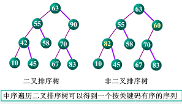
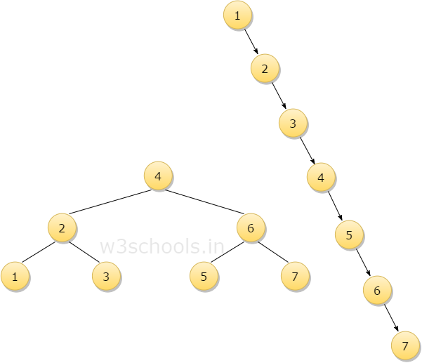
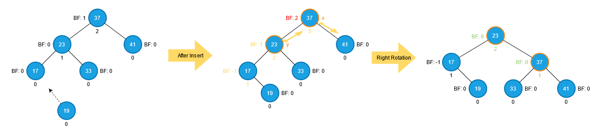

# 二叉排序树

**二叉排序树（Binary Search Tree），也称为二叉搜索树、有序二叉树或排序二叉树，是一种特殊的二叉树数据结构。**

## 有以下特点
1. 每个节点最多有两个子节点：左子节点和右子节点。
2. 对于每个节点，其左子节点的值小于该节点的值，而右子节点的值大于该节点的值。
3. 对于任意节点的左子树和右子树，它们也都是二叉排序树。

## 构建过程如下：
1. 初始状态下，二叉排序树为空树。
2. 依次将要插入的节点按照顺序插入到二叉排序树中。
3. 对于每个要插入的节点，从根节点开始，按照以下规则进行插入：
    - 如果树为空，将要插入的节点作为根节点。
    - 如果节点值小于当前节点的值，将节点插入到当前节点的左子树中。如果当前节点的左子节点为空，则将节点插入为左子节点；否则，将当前节点的左子树作为新的当前节点，重复这一步骤。
    - 如果节点值大于当前节点的值，将节点插入到当前节点的右子树中。如果当前节点的右子节点为空，则将节点插入为右子节点；否则，将当前节点的右子树作为新的当前节点，重复这一步骤。
    - 如果节点值等于当前节点的值，根据具体需求，可以忽略该节点、更新节点的值或采取其他处理方式。
4. 重复步骤3，直到所有节点都插入到二叉排序树中。

## 二叉排序树的优缺点

### 二叉排序树的优点包括：
1. 查找、插入和删除操作的时间复杂度都是 O(log n)，其中 n 是树中节点的数量。这是因为二叉排序树的结构使得可以通过比较节点值来确定搜索路径，从而提高效率。
2. 存储的数据是有序的，可以方便地进行范围查找和排序操作。 

###然而，二叉排序树也有一些缺点：
1. 如果插入的节点有序性较强，可能导致树的不平衡，使得树的高度增加，从而降低了搜索操作的效率。
2. 在最坏情况下，二叉排序树可能退化为链表，使得操作的时间复杂度变为 O(n)。

## 平衡二叉树

为了解决二叉树有序性较强，导致树的不平衡，使得树的高度增加，降低了搜索效率的问题，我们引入了平衡二叉树！

平衡二叉树（Balanced Binary Tree），也称为自平衡二叉树，是一种特殊的二叉树，其左右子树的高度差不超过一个固定的值（通常为1），以保持树的平衡性。平衡二叉树的目的是在进行插入、删除等操作时，保持树的高度尽可能低，从而提高搜索、插入和删除等操作的效率。

### 与普通的二叉排序树相比，平衡二叉树具有以下特点：
1. 左右子树的高度差不超过1，使得树的高度保持在较小的范围内，从而提高了查询、插入和删除操作的性能。
2. 通过自平衡的机制，保持树的平衡性，避免树的倾斜，确保树的各个分支相对均衡。
3. 常见的平衡二叉树包括红黑树（Red-Black Tree）、AVL树等。这些平衡二叉树在插入和删除节点时，通过旋转、颜色变换等操作来维持树的平衡性。

### 下面是AVL树的构建过程：
**1. 插入节点：** 首先按照二叉搜索树的规则将新节点插入到适当的位置。 在插入过程中，记录沿着插入路径的节点，这些节点可能会导致树的不平衡。
**2. 检查平衡性：** 从新插入的节点开始，沿着插入路径向上检查每个节点的平衡因子（即左子树高度与右子树高度的差）。 如果某个节点的平衡因子超过1或小于-1，则表示树不平衡。
**3. 调整树的结构：** 如果发现不平衡的节点，根据其左右子树的高度关系进行旋转操作，以恢复树的平衡。 AVL树的旋转操作包括左旋和右旋，可以根据具体情况选择适当的旋转操作。 旋转操作会改变节点之间的连接关系，使得树重新平衡。
**4. 重复步骤2和步骤3：** 继续向上检查父节点的平衡性，如果需要调整，则进行旋转操作，直到达到根节点或树重新平衡为止。
**5. 完成插入操作：** 当树恢复平衡后，插入操作完成。

### 平衡二叉树的优缺点

AVL树的构建过程保证了树的平衡性，使得树的高度保持在较小的范围内，从而提高了搜索、插入和删除操作的性能。由于AVL树的自平衡特性，任何节点的左子树和右子树的高度差不超过1，因此树的平衡性得到了保证。

需要注意的是，由于AVL树在维护平衡性的过程中需要频繁地进行旋转操作，因此相对于普通的二叉搜索树，AVL树的插入和删除操作可能会更加耗时。但是，AVL树适用于那些需要频繁进行搜索和插入删除操作的场景，其中数据的动态变化较大，需要保持树的平衡性，以确保操作的高效性。

## 二叉排序树在以下场景中常常应用：
1. 数据的动态插入、删除和查找频繁，并且对数据有序性要求的场景。
2. 需要进行范围查找或排序操作的场景。
3. 需要注意的是，为了避免二叉排序树的不平衡问题，可以使用平衡二叉搜索树（如红黑树、AVL树）来代替二叉排序树，以保持树的平衡性并提高性能
