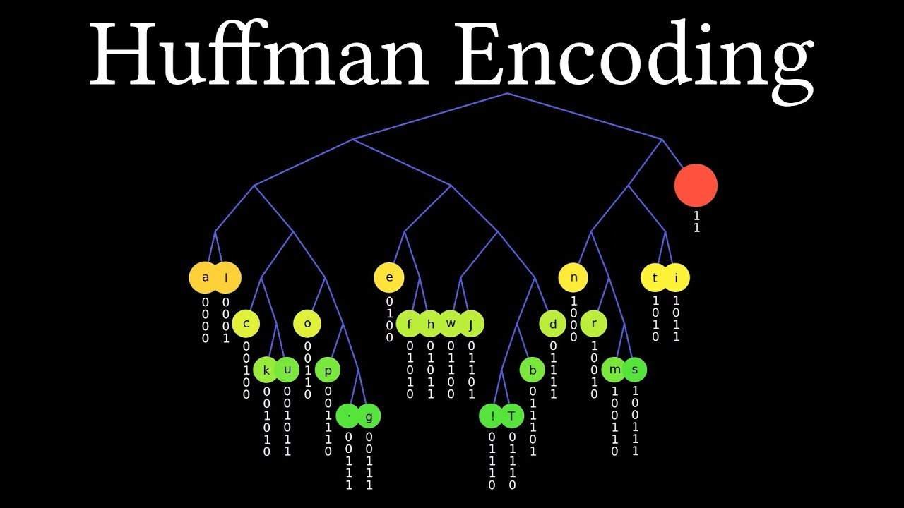

# 赫夫曼编码

**赫夫曼编码（Huffman Coding）是一种用于数据压缩的算法，它基于出现频率较高的字符使用较短的编码，而出现频率较低的字符使用较长的编码，以实现数据的高效压缩。**

## 整个赫夫曼编码的过程如下：

1. 统计给定数据中每个字符的出现频率。
2. 根据字符频率构建赫夫曼树（Huffman Tree），该树是一棵最小堆树（Min Heap Tree），其中频率较低的字符位于较低层，频率较高的字符位于较高层。
3. 根据赫夫曼树，为每个字符生成唯一的二进制编码。在赫夫曼树中，向左走表示编码为0，向右走表示编码为1，从根节点到达每个字符的路径即为其编码。
4. 将原始数据中的每个字符替换为对应的赫夫曼编码，生成压缩后的数据。

## 赫夫曼树

赫夫曼树（Huffman Tree），也称为最优二叉树（Optimal Binary Tree），是一种用于赫夫曼编码的数据结构。它是一棵特殊的二叉树，其中出现频率较高的字符位于较低的层级，出现频率较低的字符位于较高的层级，以实现数据的高效压缩。

### 赫夫曼树的构建过程如下：

1. 统计给定数据中每个字符的出现频率。
2. 将每个字符视为一个独立的节点，并根据字符频率构建最小堆（Min Heap）或最大堆（Max Heap）。频率较低的字符拥有较高的优先级，频率较高的字符拥有较低的优先级。
3. 从最小堆或最大堆中选取两个优先级最低的节点（频率最低的字符），将它们合并为一个新节点。新节点的频率为原节点频率之和，新节点作为一个整体插入堆中。
4. 重复步骤3，直到堆中只剩下一个节点，即赫夫曼树的根节点。

构建赫夫曼树的过程中，频率较低的字符被放置在树的较低层级，频率较高的字符被放置在树的较高层级。这样，树的路径长度较短的节点对应于频率较高的字符，而路径长度较长的节点对应于频率较低的字符。

赫夫曼树的构建过程保证了每个字符都有唯一的编码，而且频率较高的字符具有较短的编码，频率较低的字符具有较长的编码。这种编码方式能够实现高效的数据压缩和解压缩。

## 赫夫曼编码的应用场景包括但不限于：

1. 数据压缩：赫夫曼编码可以将数据压缩为更小的存储空间，提高数据传输和存储的效率。
2. 文件压缩：常见的压缩文件格式如ZIP、GZIP等使用了赫夫曼编码算法。
3. 图像压缩：图像文件格式如JPEG、PNG等利用赫夫曼编码来压缩图像数据。
4. 视频压缩：视频编码标准如H.264、HEVC等使用了赫夫曼编码来压缩视频数据。

通过使用赫夫曼编码，可以有效减小数据的存储空间和传输带宽，提高数据处理的效率。

## 赫夫曼编码压缩优劣势：

### 优势
1. **高效的压缩率：**赫夫曼编码根据字符出现的频率进行编码，频率较高的字符使用较短的编码，频率较低的字符使用较长的编码。这种编码方式可以大大减少文件的存储空间，实现高效的压缩率。
2. **无损压缩：**赫夫曼编码是一种无损压缩算法，意味着压缩后的文件可以完全恢复为原始文件，不会丢失任何信息。
3. **自适应编码：**赫夫曼编码是一种自适应编码，它根据实际的字符出现频率动态调整编码方式。每次编码都基于先前编码的统计信息，能够根据具体的数据特征进行优化，提高压缩效果。
4. **快速解压缩：**赫夫曼编码的解压缩过程相对简单且快速。由于编码的唯一性，解码时无需查找字符对应的编码，只需按照编码规则进行逆向解码即可。
5. **广泛应用：**赫夫曼编码在数据压缩领域得到广泛应用，常见于文件压缩、图像压缩、音频压缩等领域。它是许多压缩格式的基础，如ZIP、GZIP等。

总的来说，赫夫曼编码在文件压缩中通过高效的压缩率、无损压缩、自适应编码和快速解压缩等优势，实现了对文件存储空间的有效利用和数据传输的高效性，对于减少存储成本、提高数据传输速度等方面具有重要的价值和意义。

## 劣势

尽管赫夫曼编码在文件压缩中具有很多优势，但也存在一些缺陷，包括：

1. 需要额外的压缩字典：赫夫曼编码生成的压缩文件需要包含压缩字典，用于解码压缩文件。这意味着在解压缩文件时，需要事先获取和存储压缩字典，增加了一定的存储和传输开销。
2. 压缩效果受数据特征影响：赫夫曼编码的压缩效果取决于数据的特征，即字符出现的频率分布。对于频率分布较为均匀或者难以预测的数据，赫夫曼编码的压缩效果可能不如其他算法。因此，在某些特定的数据集上，赫夫曼编码可能无法达到最优的压缩效果。
3. 编码/解码效率较低：尽管解码过程相对简单，但编码过程需要构建赫夫曼树和生成编码表，这些操作可能需要较长的时间和计算资源。对于大规模的数据集，编码和解码的效率可能较低。
4. 不适用于小数据集：赫夫曼编码的压缩效果在小数据集上可能并不明显，甚至可能因为额外的压缩字典导致压缩文件更大。因此，在处理小型数据集时，赫夫曼编码可能不是最佳的选择。

综上所述，尽管赫夫曼编码在大多数情况下是一种高效的压缩算法，但也需要考虑到其缺陷，如额外的压缩字典、受数据特征影响、编码/解码效率较低以及不适用于小数据集等问题。在实际应用中，需要综合考虑数据特征、压缩效果和性能要求，选择合适的压缩算法。
