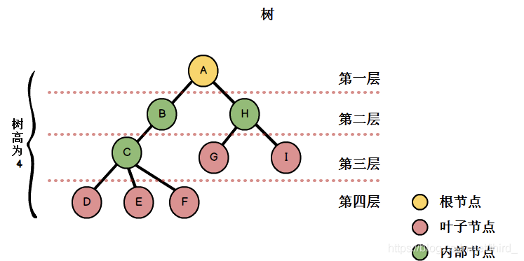
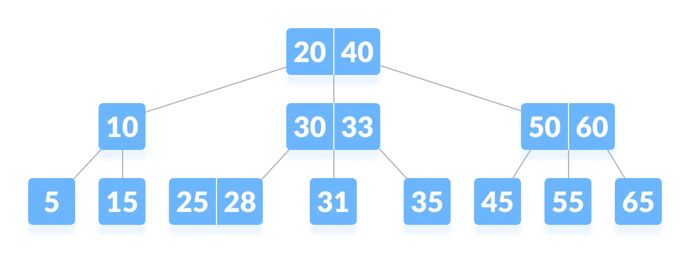

# 树

**在数据结构中，树（Tree）是一种非线性的数据结构，它由节点（Node）和节点之间的连接关系组成。树的结构类似于现实生活中的树，由根节点（Root Node）和子节点（Child Node）组成，节点之间通过边（Edge）连接。**

## 树的基本概念
1. **根节点（Root Node）**：树的顶部节点，没有父节点的节点。整个树的起始点。
2. **子节点（Child Node）：** 根据连接关系，直接连接到父节点的节点。每个节点可以有零个或多个子节点。
3. **父节点（Parent Node）：** 直接连接到子节点的节点。每个节点除了根节点外，都有且只有一个父节点。
4. **兄弟节点（Sibling Node）**：具有相同父节点的节点。兄弟节点之间没有直接连接。
5. **叶节点（Leaf Node）**：没有子节点的节点，也称为终端节点。位于树的末端。
6. **节点的度（Degree）**：一个节点的子节点的数量。
7. **树的度（Degree of Tree）**：树中所有节点的度的最大值。
8. **子树（Subtree）**：树中的任意一个节点及其所有的后代节点构成的树。 
9. **路径（Path）**：从树中的一个节点到达另一个节点的一系列连接的边。
10. **层次（Level）**：根节点为第一层，根节点的子节点为第二层，以此类推。
11. **树的高度（Height）**：树中从根节点到最远叶节点的最长路径的层数。

这些基本概念和术语描述了树结构中节点之间的关系和性质，对于理解和操作树数据结构非常重要。

## 树的数据结构之所以被广泛应用，是因为它具有以下优点和特点：
1. **层次性和分层结构：** 树是一种层次性的结构，节点之间存在明确的层次关系。每个节点可以有多个子节点，形成了分层结构，这种结构可以更好地组织和表示具有层次关系的数据。
2. **高效的查找和操作：** 树的结构使得在其中进行查找、插入和删除操作非常高效。相对于线性结构如数组和链表，树的查找操作的时间复杂度通常为O(log n)，其中n是树中节点的数量。
3. **数据的组织和排序：** 树的结构可以用于组织和排序数据。通过合理构建树的连接关系，可以快速查找和访问特定的数据项，也可以实现排序功能。
4. **递归特性：** 树的结构具有递归性质，可以通过递归算法实现对树的遍历和操作。递归算法可以简洁地描述树的操作，提高代码的可读性和易于理解性。

## 相比于其他数据结构如数组和链表，树具有以下优势：
1. **更高效的查找操作：** 相对于线性结构，树的查找操作时间复杂度更低，尤其是对于大型数据集。
2. **更好的数据组织性：** 树的结构使得数据的组织更加灵活，可以更好地表示具有层次关系的数据。
3. **便于排序和搜索：** 树的结构可以支持快速的排序和搜索操作，适用于需要频繁进行排序和搜索的场景。
4. **支持层次性操作：** 树的结构使得层次性操作更加高效和方便，例如树的层次遍历和层次统计等操作。

## 树的分类

树可以根据不同的特性和约束条件进行分类。以下是树的一些常见分类：
1. **二叉树（Binary Tree）**：每个节点最多有两个子节点的树，分为左子节点和右子节点。
2. **二叉搜索树（Binary Search Tree）**：一种特殊的二叉树，其中每个节点的值大于其左子树中任意节点的值，且小于其右子树中任意节点的值。
3. **平衡二叉树（Balanced Binary Tree）**：一种二叉搜索树，它具有保持平衡的特性，以确保在插入和删除节点时，树的高度保持较小的变化。
4. **AVL树**：一种自平衡二叉搜索树，通过保持节点的平衡因子（左子树高度与右子树高度之差）为-1、0或1来保持树的平衡。
5. **红黑树（Red-Black Tree）**：一种自平衡二叉搜索树，通过将节点标记为红色或黑色，并遵循一些约束条件来保持树的平衡。
6. **B树（B-tree）**：一种自平衡的多路搜索树，用于处理大量数据和磁盘存储。
7. **堆（Heap）**：一种特殊的树结构，用于维护优先级队列和排序操作。
8. **字典树（Trie）**：一种用于高效存储和搜索字符串的树结构，通常用于实现字典、拼写检查和自动完成等应用。

这些是树的一些常见分类，每种类型的树在不同的应用场景中有其独特的优势和用途。根据需求和问题的性质，选择适当的树结构可以提高算法和数据操作的效率。

## B树

B树（B-tree）是一种自平衡的树数据结构，广泛应用于处理大量数据和磁盘存储的场景。B树具有以下特点：

1. **多路搜索树**：B树的每个节点可以包含多个子节点，不同于二叉树的两个子节点限制。每个节点可以有更多的子节点，提供了更高的分支因子。
2. **自平衡性**：B树通过在插入和删除操作后对节点进行自平衡来保持树的平衡。通过保持每个节点的子节点数量在一定范围内，B树可以保持树的高度较低，提高搜索、插入和删除操作的效率。
3. **顺序存储**：B树的节点按顺序存储在磁盘块中，每个节点包含一组键值对。这种顺序存储的方式使得B树非常适合用于磁盘存储，减少了磁盘访问次数，提高了IO效率。

B树的变体有B+树和B*树，它们在B树的基础上做了一些改进和优化：

1. **B+树**: B+树是基于B树的变体，相比于B树，B+树的内部节点不存储键值对的具体数据，只存储键值。而所有的键值对都存储在叶子节点上，形成一个有序链表。这样的设计使得B+树更适合范围查询和顺序访问，减少了随机访问的成本。
2. **B\*树**：B\*树也是基于B树的变体，在B+树的基础上做了进一步的优化。B\*树在内部节点中存储了部分键值对的具体数据，而不仅仅是键值。这样可以减少在叶子节点上的查找次数，提高了访问效率。B\*树适用于范围查询和随机访问。

总的来说，B树、B+树和B\*树都是用于处理大规模数据和磁盘存储的数据结构。它们通过自平衡和顺序存储的方式提高了数据的访问效率，各自适用于不同的查询和访问模式。B+树和B\*树在B树的基础上做了更多的优化，更适合范围查询和顺序访问，但相应地增加了节点的大小和磁盘占用。选择适当的树结构取决于具体的应用需求和性能要求。

## 应用场景
总的来说，树作为一种重要的数据结构，广泛应用于各种领域，包括计算机科学、数据库、网络路由、图形算法等。它提供了一种高效的数据组织方式，能够快速进行查找、插入和删除操作，并支持各种高级操作和算法的实现。
